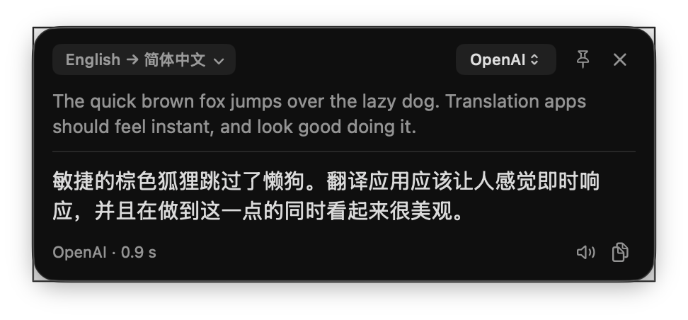

<p align="center">
  
</p>

# Trot

Trot is a native macOS menu bar app that translates selected text, typed text and screenshots in a floating panel.

<p align="center">
  
</p>

## Features

- Translate text selected in any app, with the result streaming into a panel at the mouse.
- Type or paste text into the panel and translate it.
- Translate the text in a screen region, read with Vision.
- Text in your first language goes into your second; anything else goes into your first.
- Use any OpenAI-compatible chat API (OpenAI, DeepSeek, Qwen, Ollama), Claude, DeepL or Google.

## Usage

| Hotkey | Action |
|---|---|
| ⌥D | Translate the selection |
| ⌥A | Open the panel to type text |
| ⌥S | Translate a screenshot |

In the panel, ⌘L picks another target language, ⌘1 to ⌘4 switch the service and ⌘P pins the panel. You can change the hotkeys in Settings.

## Requirements

- macOS 26 or later
- Xcode Command Line Tools, to build

## Installation

Build from source:

```sh
scripts/bundle.sh
open build/Trot.app
```

Trot runs in the menu bar and has no Dock icon. On first launch macOS asks for Accessibility access, which Trot needs to read the selection in other apps, and Settings opens so you can pick a service and enter its key. macOS asks for Screen Recording access the first time you translate a screenshot.

## Documentation

- [Using Trot](docs/using.md): the panel, hotkeys, languages and screenshots
- [Settings and data](docs/settings-and-data.md): settings, services, where data lives and launch arguments
- [Development](docs/development.md): scripts, tests and project layout

## License

[MIT](LICENSE)
