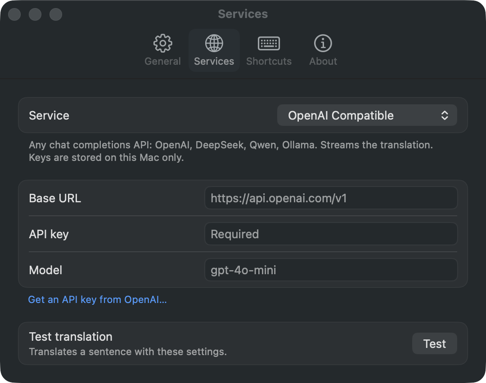

# Settings and data

## Settings

Settings opens from the menu bar icon or with ⌘, while a Trot window is key. Changes save as you make them.

| Pane | Setting | Default | Notes |
|---|---|---|---|
| General | First language | 简体中文 | The target for text in any other language |
| General | Second language | English | The target for text already in the first language. Picking the same language for both swaps them |
| General | Open Trot at login | off | Through the system login items. When macOS waits for approval, the pane says so |
| General | Accessibility | | Shows whether the permission is granted |
| Services | Service | OpenAI Compatible | The active service, also switchable in the panel |
| Services | Base URL | per service | OpenAI Compatible: `https://api.openai.com/v1`. Claude: `https://api.anthropic.com`. Point it at DeepSeek, Qwen, Ollama or a proxy. A missing scheme is added (`http` for localhost and `.local` names, `https` otherwise) and a pasted endpoint path dropped; the pane shows the URL requests go to |
| Services | API key | empty | DeepL keys ending in `:fx` use the free API |
| Services | Model | per service | OpenAI Compatible: `gpt-4o-mini`. Claude: `claude-opus-5-5` |
| Services | Test | | Translates a sentence with the current settings, from English into whatever English goes to, and shows the result or the error |
| Shortcuts | Translate Selection | ⌥D | Click, then press a combination with ⌘, ⌥ or ⌃. The held modifiers show as you press them. Delete clears it. Reset is enabled only for a changed shortcut |
| Shortcuts | Translate Input | ⌥A | |
| Shortcuts | Translate Screenshot | ⌥S | |
| About | | | The version, a short description and links to the project |

Under the API key field a link opens the page where the service hands out keys. Every pane is the same width, so switching between them moves nothing.

<p align="center">
  
</p>

Shortcuts are registered system-wide through Carbon hotkeys, which work without the Accessibility permission. When another app already holds a combination, the pane says so.

## Services

| Service | How | Streams |
|---|---|---|
| OpenAI Compatible | `POST {base}/chat/completions` with a translation system prompt. A gateway that ignores `stream` and answers with one JSON message works too | yes |
| Claude | `POST {base}/v1/messages`. Claude 5 models run at low effort with Anthropic's server-side fallback, so a safety decline reruns on a fallback model | yes |
| DeepL | `POST /v2/translate` on the free or Pro host, chosen by the key's suffix | no |
| Google | The `translate_a/single` endpoint Google's web client uses, with the text in a form body. No key. Unofficial, so it can stop working | no |

DeepL and Google are told the source language only when the script makes it certain (Chinese, Japanese, Korean, Thai); for everything else they detect it themselves, which beats a local guess on a short string or a script several languages share. The LLM services always get the detected language as a hint.

The connection to the service opens when a hotkey is pressed, so its setup overlaps with reading the selection. Requests give up after 30 seconds without data and 3 minutes in all. A reply that isn't a translation, such as a web page from a wrong base URL, is shown as an error rather than an empty result, and so are an empty translation and one the service cut off at its output limit. A status code with no message of its own reads as a sentence, such as "The API key was rejected (HTTP 401)". Errors that Settings can fix, a missing or rejected key or a wrong base URL, come with an Open Settings button; Google, which has nothing to set, gets Retry.

## Data

Settings, API keys included, live in the app's user defaults, `dev.sorrycc.trot.app`. Versions before 0.3.1 used `dev.sorrycc.trot`, whose menu bar icon macOS 26 can keep hidden; the first launch under the new id copies the old settings over. Accessibility access and launch at login are tied to the id, so they need to be turned on again once. The keychain is not used: an ad-hoc signed app has a new identity after every build, and the keychain would ask for permission each time. Trot keeps no history and sends text only to the service you chose.

## Launch arguments

For trying the app from a script:

```sh
open build/Trot.app --args -translate "Hello"        # open the panel with that text
open build/Trot.app --args -input YES                # open the input panel
open build/Trot.app --args -settings Services        # open a Settings pane
open build/Trot.app --args -preview YES -translate … # show the panel without taking the keyboard
open build/Trot.app --args -appearance dark          # force dark (or light) for a screenshot
```

## Trying the panel without a key

`scripts/mock-service.py` serves a fake OpenAI-compatible API on `http://127.0.0.1:48765`. Any setting can be given as a launch argument, which overrides the saved one for that run only:

```sh
open build/Trot.app --args -service openAI -service.openAI.baseURL http://127.0.0.1:48765/v1 -service.openAI.apiKey x -translate hello
```

The path picks the behaviour: `/v1` streams a translation one character at a time, `/slow` does so slowly, `/fail` answers with an error, `/plain` ignores `stream` and answers with one message, as some gateways do, `/empty` streams nothing, `/rtl` answers in Arabic, `/long` with several screens of text, and `/length` stops with `finish_reason: length`, as a cut-off reply does.

## Tests

`scripts/test.sh` runs the unit tests with Swift Testing. They cover language detection, the two-language rule and the swap, shortcut parsing and display, the joining of screenshot lines into paragraphs, the HTTP helpers, base URL tidying, error messages, the service language codes, and which button an error gets. The script adds the framework paths the Command Line Tools need; with Xcode installed, `swift test --package-path app` works too.
